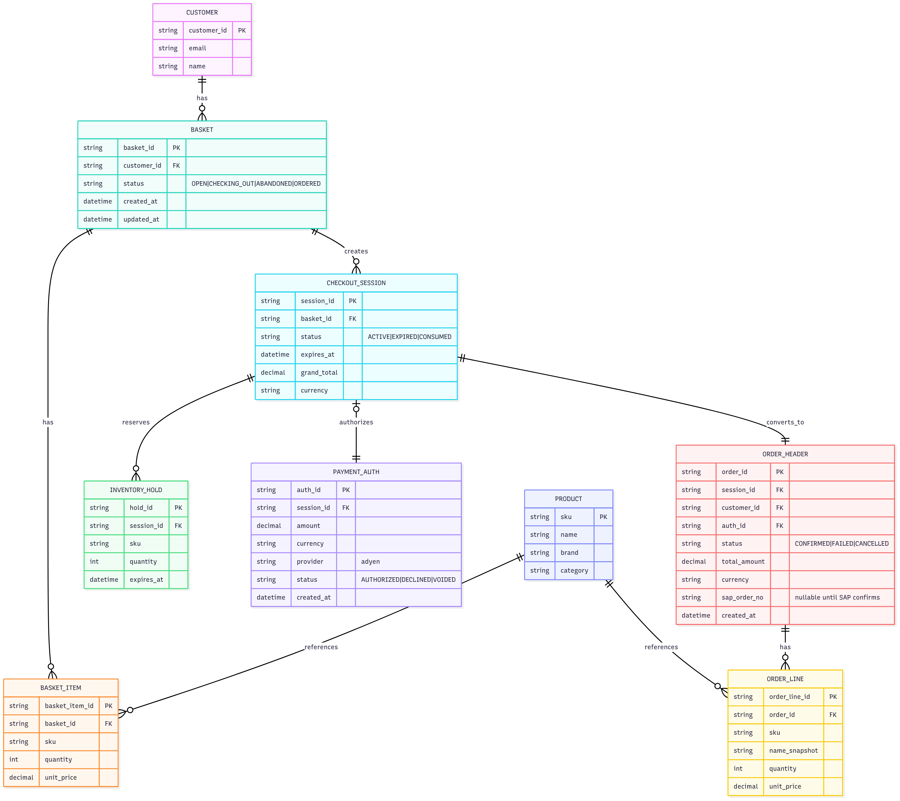

### Checkout Data Model

When it comes to the checkout process, the following microservices are involved:

- **Basket Service** – manages baskets, items, and checkout sessions (including soft inventory holds).  
- **Payment Service** – handles payment authorization and captures via PSP later when goods are shipped from the warehouse. 
- **Order Service** – creates and manages confirmed orders and order lines.

All these microservices use data sources and ER diagram below represents the key database tables (entities) used in the data model and the relationships between them.

  

