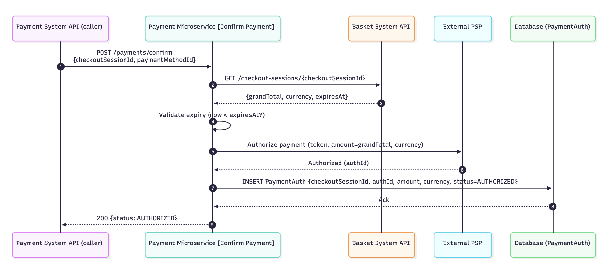

### Purpose

The Payment microservice handles authorization and capture of payments.
It integrates with an external PSP (Payment Service Provider).

### Interfaces Owned

| Operation                     | Method & URI                          | Description                                                      | Database Tables Used       | Schemas |
|------------------------------|---------------------------------------|------------------------------------------------------------------|----------------------------|---------|
| Confirm Payment (Authorize)  | `POST /payments/confirm`              | Authorizes the checkout session amount using a PSP token.        | `PaymentAuth` | Refer to **Payment System API** service contract |
| Capture Payment              | `POST /payments/{authId}/capture`     | Captures a previously authorized payment (full capture in scope).| `PaymentAuth`             | Refer to **Payment System API** service contract |

### Internal Design of Interfaces

##### Confirm Payment (Authorize)

  

##### Capture Payment (Authorize)

