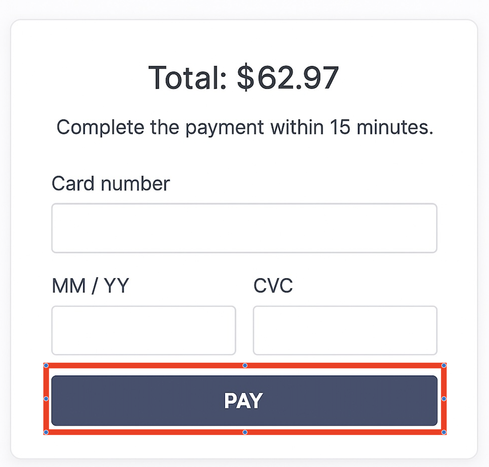
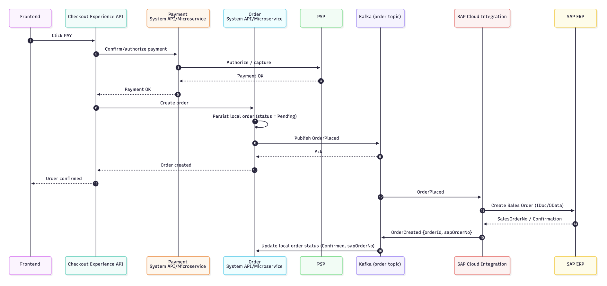
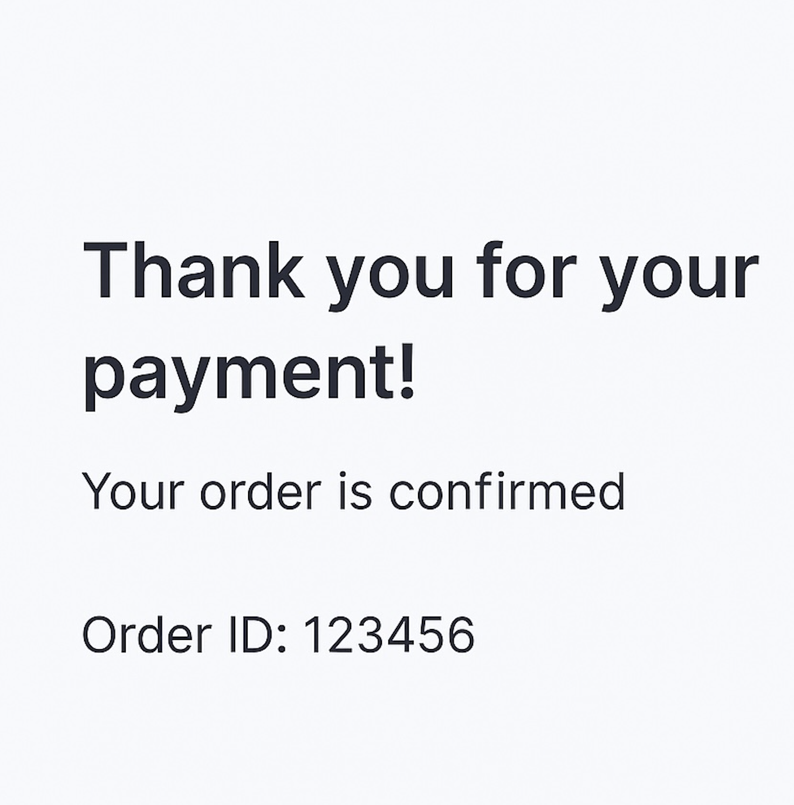

<h3>Step 1: User reviews cart and clicks ‘proceed to checkout’ in the UI.</h3>

  

Upon user clicking ‘Proceed to Checkout’, FE will invoke checkout experience API’s ‘start’ operation, and below is a sequence diagram showing integration layer actions in response to that.

  

<h3>Step 2: User enters payment details and click ‘PAY’ in the UI.</h3>

  

Upon use clicking ‘PAY’, FE will invoke checkout experience API’s ‘complete’ operation, and below is a sequence diagram showing integration layer actions in response to that.

  

<h3>Step 3: User will be displayed with the order confirmation screen once payment is successful.</h3>

  

