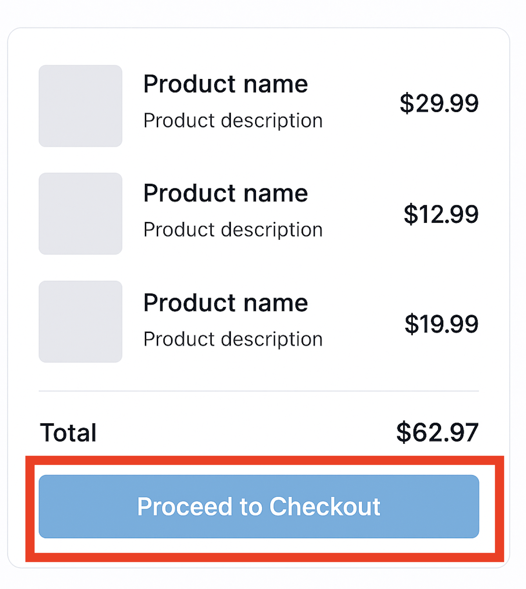
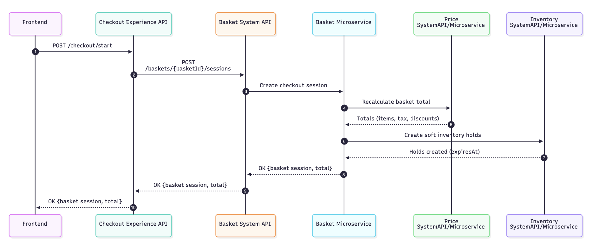

**Step 1: User reviews cart and clicks ‘proceed to checkout’ in the UI.**

  

Upon use clicking ‘Proceed to Checkout’, FE will invoke checkout API’s ‘start’ operation, and below is a sequence diagram showing integration layer actions in response to that.

  

